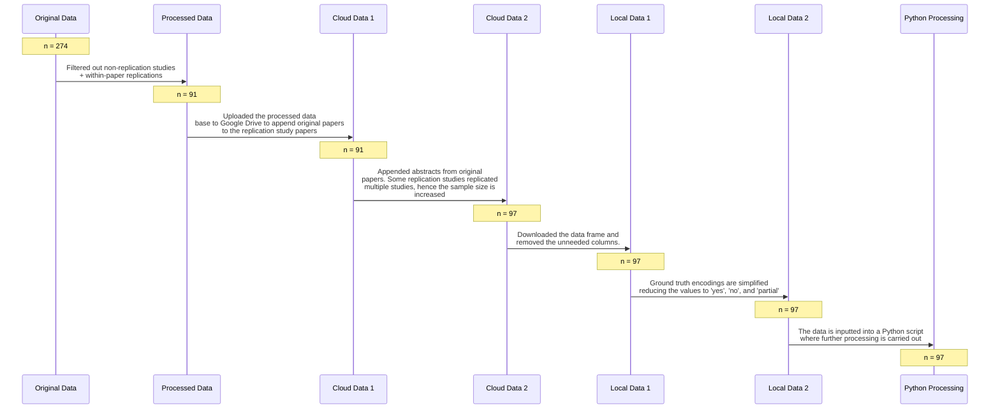

```mermaid

sequenceDiagram
    Note over Original Data: n = 274
    
    Original Data ->> Processed Data: Filtered out non-replication studies <br> + within-paper replications
    
    Note over Processed Data: n = 91
    
    Processed Data ->> Cloud Data 1: Uploaded the processed data <br> base to Google Drive to append original papers <br> to the replication study papers

    Note over Cloud Data 1: n = 91

    Cloud Data 1 ->> Cloud Data 2: Appended abstracts from original <br> papers. Some replication studies replicated <br> multiple studies, hence the sample size is <br> increased

    Note over Cloud Data 2: n = 97

    Cloud Data 2 ->> Local Data 1: Downloaded the data frame and <br> removed the unneeded columns.

    Note over Local Data 1: n = 97

    Local Data 1 ->> Local Data 2: Ground truth encodings are simplified <br> reducing the values to 'yes', 'no', and 'partial'

    Note over Local Data 2: n = 97

    Local Data 2 ->> Python Processing: The data is inputted into a Python script <br> where further processing is carried out

    Note over Python Processing: n = 97

```

