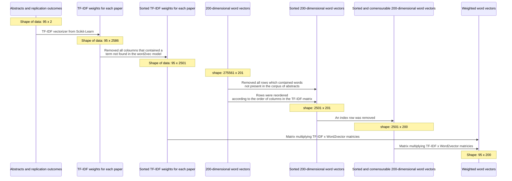

```mermaid

sequenceDiagram
    Note over Abstracts and replication outcomes: Shape of data: 95 x 2
    
    Abstracts and replication outcomes ->> TF-IDF weights for each paper: TF-IDF vectorizer from Scikit-Learn
    
    Note over TF-IDF weights for each paper: Shape of data: 95 x 2586

    TF-IDF weights for each paper ->> Sorted TF-IDF weights for each paper: Removed all coloumns that contained a <br> term not found in the word2vec model

    Note over Sorted TF-IDF weights for each paper: Shape of data: 95 x 2501
    
    Note over 200-dimensional word vectors: shape: 275561 x 201

    200-dimensional word vectors ->> Sorted 200-dimensional word vectors: Removed all rows which contained words <br> not present in the corpus of abstracts

    200-dimensional word vectors ->> Sorted 200-dimensional word vectors: Rows were reordered <br> according to the order of columns in the TF-IDF-matrix
  
    Note over Sorted 200-dimensional word vectors: shape: 2501 x 201

    Sorted 200-dimensional word vectors ->> Sorted and comensurable 200-dimensional word vectors: An index row was removed

    Note over Sorted and comensurable 200-dimensional word vectors: shape: 2501 x 200

    Sorted TF-IDF weights for each paper ->> Weighted word vectors:  Matrix multiplying TF-IDF x Word2vector matricies

    Sorted and comensurable 200-dimensional word vectors ->> Weighted word vectors: Matrix multiplying TF-IDF x Word2vector matricies

    Note over Weighted word vectors: Shape: 95 x 200


```

